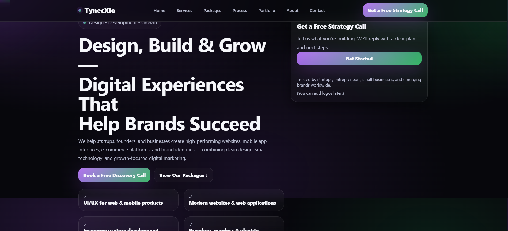

# TynecXio — Official Website


**TynecXio** is a premium digital agency specializing in **Design, Development, and Growth**.  
This repository contains the official website built with modern frontend tooling and deployed on Vercel.

🌐 **Live Website:** https://tynecxio.com

---

## ✨ Features

- Agency-level premium UI & visual design
- Smooth animations & micro-interactions (Framer Motion)
- Animated gradient hero background
- Fully responsive (mobile, tablet, desktop)
- Fast performance & optimized assets
- Contact form with email delivery
- Serverless backend (Vercel Functions)

---

## 🧱 Tech Stack

- **Frontend:** React + Vite
- **Animations:** Framer Motion
- **Styling:** Modern CSS (custom system)
- **Backend:** Vercel Serverless Functions
- **Email Service:** Resend
- **Hosting:** Vercel

---

## 📂 Project Structure

tynecxio/
├─ api/
│ └─ contact.js # Serverless email API
├─ client/
│ ├─ public/
│ │ └─ preview.png # Website preview image
│ ├─ src/
│ │ ├─ components/
│ │ ├─ pages/
│ │ ├─ App.jsx
│ │ ├─ main.jsx
│ │ └─ styles.css
│ ├─ index.html
│ ├─ vite.config.js
│ └─ package.json
├─ .gitignore
├─ package.json
└─ README.md

---

## 🚀 Getting Started (Local Development)

### 1️⃣ Install dependencies
```bash
cd client
npm install
2️⃣ Run the development server
bash
Copy code
npm run dev
Open in browser:
👉 http://localhost:5173

📩 Contact Form & Email Setup (Resend)
This project uses Resend with a Vercel Serverless Function.

Required Environment Variables (Vercel)
Add these in Vercel → Project → Settings → Environment Variables:

env
Copy code
RESEND_API_KEY=your_resend_api_key
CONTACT_TO_EMAIL=career@tynecxio.com
CONTACT_FROM_EMAIL=TynecXio <no-reply@tynecxio.com>
CONTACT_FROM_EMAIL must be a verified sender in Resend.

🌍 Deployment
The website is deployed using Vercel with automatic CI/CD from GitHub.

Push to main branch

Vercel builds & deploys automatically

Serverless API available at /api/contact

Live URL:
👉 https://tynecxio.com
---
## 🌐 Live Preview

<p align="center">
  
</p>


📬 Contact
For business inquiries or collaboration:
📧 career@tynecxio.com

📄 License

© 2025 TynecXio. All rights reserved.
This repository is proprietary and maintained by TynecXio.
